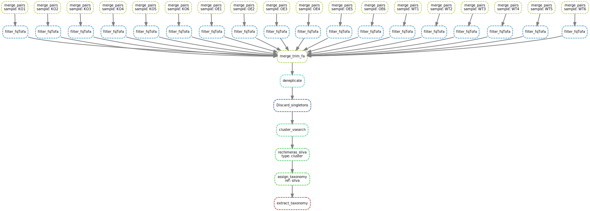

### A workflow to process paired-end stranded amplicon sequence by Snakemake

#### Step1

quality screen on fastq by fastqc and multiqc

#### step2
* merge PE reads into one read
* trim reads into fas by filtering primeter or barcode through vsearch
* merge all filtered fa files into one file by command cat

#### step3
deredundancy the fas by vsearch 

#### step4
identity OTU by vsearch

#### step5 
remove chimeras on represented OTU by vsearch

#### step6
obtain OTU table by vsearch 
