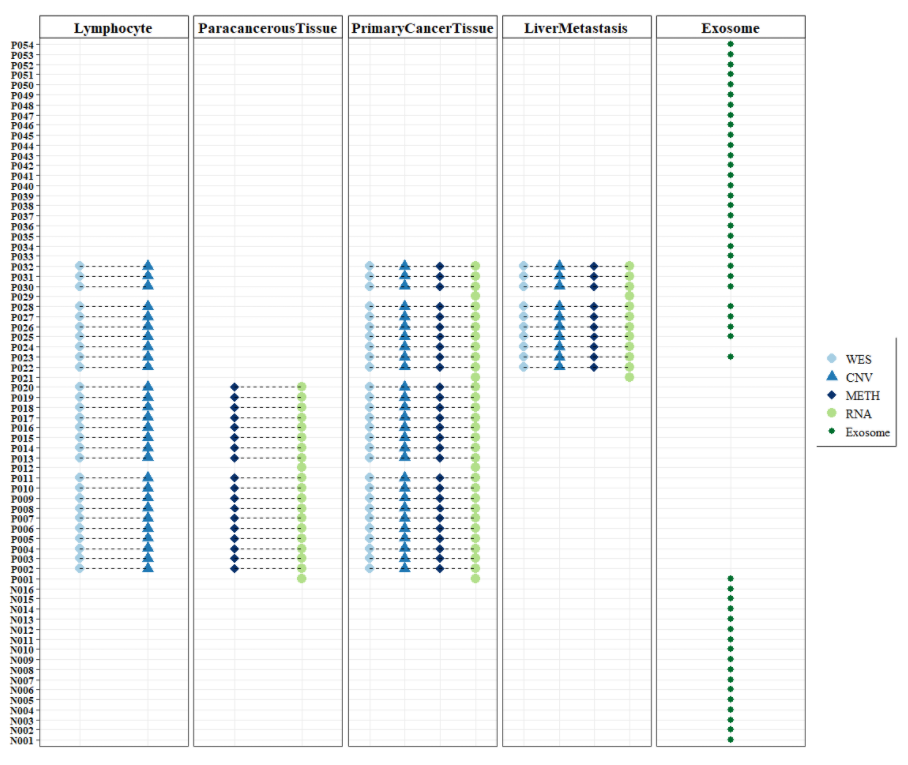

### Introdution

DNA methylation data has been detected in *ParacancerousTissue*, *PrimaryCancerTissue* and *LiverMetastasis*, however some participants only had two or three data, so I would do the EDA with paired samples in two conditions:

1. **ParacancerousTissue** versus **PrimaryCancerTissue** (n=18, the paired participant);

2. **PrimaryCancerTissue** versus **LiverMetastasis** (n=10, the paired participant).

<details>
<summary>Figures of Data Distribution</summary>

<p align="center">

</p>

<h4 align = "center"> Data Distribution in the population </h4>

</details>

In the same time, There are two approaches, such as *Differentially Methylated Positions(probe sites)* and *Differentially Methylated Regions(several proximal CpGs)* for performing DEA process. 


```{r setup, include=FALSE}
knitr::opts_chunk$set(warning = F, message = F)
options(warn = -1)
library(dplyr)
library(tibble)
library(ggplot2)
library(convert)
library(limma)
library(data.table)
options(warn = 0)

# rm(list = ls())
options(stringsAsFactors = F)
options(future.globals.maxSize = 1000 * 1024^2)
```


### Importing Data 

* $\beta-value = \frac{methylated}{methylated+unmethylated}$, representing the proportional methylated signals, were used for graphical visualization

* $M-value=\log_2{(\frac{\beta}{1-\beta})}$ were used for testing statistical significance.

```{r}
phen <- read.csv("../../Result/phenotype/Pancreatic_tumor_merge_20210426.csv")
bVals <- fread("../00.RawData/Methylation/result/Matrix/NormalisedFilteredBetaTable.csv")
mVals <- fread("../00.RawData/Methylation/result/Matrix/NormalisedFilteredMTable_noInf.csv")
```


### acquiring the ExpressionSet object via the group parameters
```{r}
# get profile and phenotype
get_paired_data <- function(
                     metadata  = phen,
                     profile   = mVals,
                     group_col = c("ParacancerousTissue", "PrimaryCancerTissue")){
  
  # metadata  = phen
  # profile   = mVals
  # group_col=c("ParacancerousTissue", "PrimaryCancerTissue")
  
  phen_group1 <- metadata %>% filter(Omics=="METH") %>%
    filter(Type%in%group_col[1])
  phen_group2 <- metadata %>% filter(Omics=="METH") %>% 
    filter(Type%in%group_col[2])
  pid <- intersect(phen_group1$PID, phen_group2$PID)
  phen <- metadata %>% filter(Omics=="METH") %>%
    filter(Type%in%group_col) %>%
    filter(PID %in% pid) %>%
    column_to_rownames("SampleID")
  
  prof <- profile %>% column_to_rownames("V1") %>%
    dplyr::select(rownames(phen))
  
  # determine the right order between profile and phenotype 
  for(i in 1:ncol(prof)){ 
    if (!(colnames(prof)[i] == rownames(phen)[i])) {
      stop(paste0(i, " Wrong"))
    }
  }
  
  require(convert)
  exprs <- as.matrix(prof)
  adf <-  new("AnnotatedDataFrame", data=phen)
  experimentData <- new("MIAME",
        name="ShuiLin Liao", lab="Dong gdl Lab",
        contact="dong_ming@grmh-gdl.cn",
        title="Pancreatic tumor Experiment",
        abstract="The DNA Methylation ExpressionSet",
        url="www.grmh-gdl.cn",
        other=list(notes="Chosen by groups"))
  expressionSet <- new("ExpressionSet", exprs=exprs,
                       phenoData=adf, 
                       experimentData=experimentData)
  
  return(expressionSet)
}

if(!file.exists("../../Result/profile/Paracancerous_PrimaryCancer_MethExprSet_bVals.RDS")){
  ExprSet1_bVals <- get_paired_data(
                     metadata  = phen,
                     profile   = bVals, 
                     group_col = c("ParacancerousTissue", "PrimaryCancerTissue"))
  saveRDS(ExprSet1_bVals, "../../Result/profile/Paracancerous_PrimaryCancer_MethExprSet_bVals.RDS", 
          compress = TRUE)
}else{
  ExprSet1_bVals <- readRDS("../../Result/profile/Paracancerous_PrimaryCancer_MethExprSet_bVals.RDS")
}

if(!file.exists("../../Result/profile/PrimaryCancer_Liver_MethExprSet_bVals.RDS")){
  ExprSet2_bVals <- get_paired_data(
                       metadata  = phen,
                       profile   = bVals,
                       group_col = c("PrimaryCancerTissue", "LiverMetastasis"))  
  saveRDS(ExprSet2_bVals, "../../Result/profile/PrimaryCancer_Liver_MethExprSet_bVals.RDS", 
          compress = TRUE)
}else{
  ExprSet2_bVals <- readRDS("../../Result/profile/PrimaryCancer_Liver_MethExprSet_bVals.RDS")
}


# mVals
if(!file.exists("../../Result/profile/Paracancerous_PrimaryCancer_MethExprSet_mVals.RDS")){
  ExprSet1_mVals <- get_paired_data(
                     metadata  = phen,
                     profile   = mVals, 
                     group_col = c("ParacancerousTissue", "PrimaryCancerTissue"))
  saveRDS(ExprSet1_mVals, "../../Result/profile/Paracancerous_PrimaryCancer_MethExprSet_mVals.RDS", 
          compress = TRUE)
}else{
  ExprSet1_mVals <- readRDS("../../Result/profile/Paracancerous_PrimaryCancer_MethExprSet_mVals.RDS")  
}

if(!file.exists("../../Result/profile/PrimaryCancer_Liver_MethExprSet_mVals.RDS")){
  ExprSet2_mVals <- get_paired_data(
                     metadata  = phen,
                     profile   = mVals,
                     group_col = c("PrimaryCancerTissue", "LiverMetastasis"))
  saveRDS(ExprSet2_mVals, "../../Result/profile/PrimaryCancer_Liver_MethExprSet_mVals.RDS", compress = TRUE)
}else{
  ExprSet2_mVals <- readRDS("../../Result/profile/PrimaryCancer_Liver_MethExprSet_mVals.RDS")  
}
```


### Differentially Methylated Positions
```{r}
# Differentially Methylated Positions(probe sites) by limma
get_DMP <- function(dataset_m = ExprSet1_mVals,
                    dataset_beta = ExprSet1_bVals,
                    group_col=c("ParacancerousTissue", "PrimaryCancerTissue"),
                    pair=TRUE,
                    fc=1,
                    Pval=0.05){

  # dataset_m    = ExprSet1_mVals
  # dataset_beta = ExprSet1_bVals
  # group_col=c("ParacancerousTissue", "PrimaryCancerTissue")
  # pair=TRUE
  # fc=1
  # Pval=0.05
  
  # m value
  pheno <- pData(dataset_m)
  pheno$Type <- factor(as.character(pheno$Type), levels = group_col)
  pheno$PID <- factor(as.character(pheno$PID))
  
  # beta value
  pheno_beta <- pData(dataset_beta)
  pheno_beta$Type <- factor(as.character(pheno_beta$Type), levels = group_col)
  pheno_beta$PID <- factor(as.character(pheno_beta$PID))
  exprSet_beta <- as.matrix(exprs(dataset_beta))  
  
  if(pair){
    # paired test 
    design <- model.matrix(~ pheno$Type + pheno$PID)
    rownames(design) <- rownames(pheno)
    colnames(design) <- c("Intercept",
                          paste(group_col, collapse = "-"), 
                          as.character(unique(pheno$PID)[-1]))    
  }else{
    design <- model.matrix(~0 + pheno$Type)
    rownames(design) <- rownames(pheno)
    colnames(design) <- group_col
  }

  # show distribution
  edata <- as.matrix(exprs(dataset_m))
  exprSet <- edata  
  boxplot(exprSet)
  plotDensities(exprSet)
  
  # linear fitting 
  # limma_voom <- voom(exprSet, design, plot = TRUE)
  fit <- lmFit(exprSet, design)
  
  if(pair){
    # eBayes
    fit2 <- eBayes(fit)
    qqt(fit2$t, df = fit2$df.prior+fit2$df.residual, pch = 16, cex = 0.2)
    abline(0,1)
    
    # differential features
    diff_gene <- topTable(fit2, number = Inf, adjust.method = 'BH', coef = 2) %>%
      rownames_to_column("GeneID") 
    
    # delta beta value between two groups 
    # library(parallel)
    # no_cores <- detectCores() - 10
    # cl <- makeCluster(no_cores)
    require(future.apply)
    plan(multiprocess, workers = 40)
    delta_value <- future_apply(exprSet_beta, 1, function(x, y){
      # x = exprSet[1, ]
      # y = pheno
      dat <- data.frame(value=x, y) %>%
        arrange(PID, Type) %>%
        dplyr::select(PID, Type, value) 
      dat$Type <- factor(dat$Type, levels = group_col)
      
      dat_delta <- dat %>% group_by(PID, Type) %>%
        summarise(median_value=median(value)) %>%
        mutate(delta=dplyr::first(median_value) - dplyr::last(median_value)) %>%
        ungroup()
      
      delta <- mean(dat_delta$delta)
      return(delta)
      
    }, pheno_beta) %>% data.frame() %>%
      setNames("Delta") %>%
      rownames_to_column("GeneID")
    
    # stopCluster(cl)
    
    # combine DEG and delta
    diff_gene_delta <- inner_join(diff_gene, delta_value, by = "GeneID")
    
    
  }else{
    # contrast group for unpaired test  
    group <- paste(group_col, collapse = "-")
    if(group%in%"ParacancerousTissue-PrimaryCancerTissue"){
      contrast <- makeContrasts(contrasts = "ParacancerousTissue-PrimaryCancerTissue",
                                levels    = design)
    }else if(group%in%"PrimaryCancerTissue-LiverMetastasis"){
      contrast <- makeContrasts(contrasts = "PrimaryCancerTissue-LiverMetastasis",
                                levels    = design)
    }
    print(contrast)
    # eBayes
    fit2 <- contrasts.fit(fit, contrast)
    fit2 <- eBayes(fit2)
    
    qqt(fit2$t, df = fit2$df.prior+fit2$df.residual, pch = 16, cex = 0.2)
    abline(0,1)
    
    # differential features
    diff_gene <- topTable(fit2, number = Inf, adjust.method = 'BH', coef = 1) %>%
      rownames_to_column("GeneID") 
    
    # plot the top 4 most significantly differentially methylated CpGs 
    # par(mfrow=c(2, 2))
    # sapply(diff_gene$GeneID[1:4], function(cpg){
    #   plotCpg(edata, cpg=cpg, pheno=pheno$Type, ylab=paste("M values"))
    # })
    
    # delta beta value between two groups: delta = value(g1) - value(g2)
    # library(parallel)
    # no_cores <- detectCores() - 10
    # cl <- makeCluster(no_cores)
    require(future.apply)
    plan(multiprocess, workers = 40)
    delta_value <- future_apply(exprSet_beta, 1, function(x, y){
      # x = exprSet[1, ]
      # y = pheno
      dat <- data.frame(value=x, y) %>%
        arrange(Type) %>%
        dplyr::select(Type, value) 
      dat$Type <- factor(dat$Type, levels = group_col)
      
      dat_delta <- dat %>% group_by(Type) %>%
        summarise(mean_value=mean(value)) %>%
        mutate(delta=dplyr::first(median_value) - dplyr::last(median_value)) %>%
        ungroup() 
      
      delta <- mean(dat_delta$delta)
      return(delta)
      
    }, pheno_beta) %>% data.frame() %>%
      setNames("Delta") %>%
      rownames_to_column("GeneID")
    
    # stopCluster(cl)
    
    # combine DEG and delta
    diff_gene_delta <- inner_join(diff_gene, delta_value, by = "GeneID")    
  }
  
  # validate the enriched directory
  data.frame(exprSet_beta)[rownames(data.frame(exprSet_beta))%in%diff_gene_delta$GeneID[1], , F] %>% 
    t() %>% data.frame() %>%
    setNames("Gene") %>%
    rownames_to_column("SampleID") %>%
    inner_join(pheno%>%rownames_to_column("SampleID"), by = "SampleID") -> a1
  print(ggplot(a1, aes(x=Type, y=Gene))+
    geom_boxplot()+
    labs(y=diff_gene_delta$GeneID[1], x="")+
    geom_line(aes(group=PID))+
    theme_bw())  
  
  # hypomethylated loci: logFC > 1 =~ g1;  logFC < -1 =~ g2 
  diff_gene_delta[which(diff_gene_delta$logFC >= fc & diff_gene_delta$adj.P.Val < Pval), 
                  "Hypomethylated"] <- group_col[1]
  diff_gene_delta[which(diff_gene_delta$logFC <= -fc & diff_gene_delta$adj.P.Val < Pval), 
                  "Hypomethylated"] <- group_col[2]
  diff_gene_delta[which(abs(diff_gene_delta$logFC) < fc | diff_gene_delta$adj.P.Val >= Pval), 
                  "Hypomethylated"] <- "Nonsignif"
  
  diff_gene_delta$Block <- paste(group_col, collapse = "_vs_")
  
  # CpG probe sites annotation
  if(!file.exists("../../Result/GeneID/EPIC_annotation.RDS")){
    require(IlluminaHumanMethylationEPICmanifest)
    require(IlluminaHumanMethylationEPICanno.ilm10b4.hg19) 
    annEPIC <- getAnnotation(IlluminaHumanMethylationEPICanno.ilm10b4.hg19)
    saveRDS(annEPIC, "../../Result/GeneID/EPIC_annotation.RDS")
    
  }else{
    annEPIC <- readRDS("../../Result/GeneID/EPIC_annotation.RDS")
  }
  
  annEPIC_sub <- annEPIC[match(diff_gene_delta$GeneID, annEPIC$Name),
                     c(1:4, 12:19, 22:31)]
  res <- diff_gene_delta %>% dplyr::select(GeneID, Block, logFC, adj.P.Val, Hypomethylated, everything()) %>%
    arrange(adj.P.Val, logFC) %>%
    inner_join(annEPIC_sub %>% data.frame() %>% rownames_to_column("GeneID"), 
               by = "GeneID")
  
  print(dim(res %>% filter(Hypomethylated != "Nonsignif")))
  
  return(res)
}

DMP1 <- get_DMP(dataset_m    = ExprSet1_mVals,
                dataset_beta = ExprSet1_bVals,
                group_col = c("ParacancerousTissue", "PrimaryCancerTissue"),
                pair      = TRUE,
                fc        = 1,
                Pval      = 0.05)
write.csv(DMP1, "../../Result/Differential/Paracancerous_PrimaryCancer_DMP.csv", 
          row.names = F)

DMP2 <- get_DMP(dataset_m    = ExprSet2_mVals,
                dataset_beta = ExprSet2_bVals,
                group_col = c("PrimaryCancerTissue", "LiverMetastasis"),
                pair      = TRUE,
                fc        = 1,
                Pval      = 0.05)
write.csv(DMP2, "../../Result/Differential/PrimaryCancer_Liver_DMP.csv", 
          row.names = F)
```


### Differentially Methylated Regions
```{r}
# Differentially Methylated Regions(several proximal CpGs) by DMRcate
get_DMR <- function(dataset=ExprSet1_mVals,
                    group_col=c("ParacancerousTissue", "PrimaryCancerTissue"),
                    type="M",
                    fc=1,
                    Pval=0.05,
                    FDRcutoff=0.001){

  # dataset=ExprSet1_mVals
  # group_col=c("ParacancerousTissue", "PrimaryCancerTissue")
  # type="M"
  # fc=1
  # Pval=0.05
  
  pheno <- data.table(pData(dataset))
  # the interested factor 
  Type <- factor(as.character(pheno$Type), levels = group_col)
  # this is the individual effect that we need to account for
  PID <- factor(as.character(pheno$PID))
  
  # use the above to create a design matrix
  ### old
  design <- model.matrix(~ 0 + Type + PID, data = pheno)
  rownames(design) <- rownames(pheno)
  colnames(design) <- c(levels(Type), levels(PID)[-1])
  # design <- model.matrix(~ 0 + Type, data = pheno)
  # rownames(design) <- rownames(pheno)
  # colnames(design) <- c(levels(Type))  
  
  # fit the linear model 
  edata <- as.matrix(exprs(dataset))
  fit <- lmFit(edata, design)
  
  # create a contrast matrix for specific comparisons
  group <- paste(group_col, collapse = "-")
  if(group%in%"ParacancerousTissue-PrimaryCancerTissue"){
      contrast <- makeContrasts(contrasts = "ParacancerousTissue-PrimaryCancerTissue",
                                levels    = design)
  }else if(group%in%"PrimaryCancerTissue-LiverMetastasis"){
      contrast <- makeContrasts(contrasts = "PrimaryCancerTissue-LiverMetastasis",
                                levels    = design)
  }
  #print(contrast)
  
  # fit the contrasts
  fit2 <- contrasts.fit(fit, contrast)
  fit2 <- eBayes(fit2)
  
  # look at the numbers of DM CpGs at FDR < 0.05
  summary(decideTests(fit2))  
  
  # differential features
  diff_gene <- topTable(fit2, number = Inf, adjust.method = 'BH', coef = 1) %>%
      rownames_to_column("GeneID")
  
  # hypomethylated loci (the lower value either beta or M value): logFC > 1 =~ g2;  logFC < -1 =~ g1 
  # it is very unbelievable I got the opposite results with the same comparison, 
  # I suppose the reason must be contrast matrix
  diff_gene[which(diff_gene$logFC >= 1 & diff_gene$adj.P.Val < 0.05), 
                  "Hypomethylated"] <- group_col[2]
  diff_gene[which(diff_gene$logFC <= -1 & diff_gene$adj.P.Val < 0.05), 
                  "Hypomethylated"] <- group_col[1]
  diff_gene[which(abs(diff_gene$logFC) < 1 | diff_gene$adj.P.Val >= 0.05), 
                  "Hypomethylated"] <- "Nonsignif"  
  #table(diff_gene$Hypomethylated)
  
  # CpG probe sites annotation
  if(!file.exists("../../Result/GeneID/EPIC_annotation.RDS")){
    library(IlluminaHumanMethylationEPICmanifest)
    library(IlluminaHumanMethylationEPICanno.ilm10b4.hg19) 
    annEPIC <- getAnnotation(IlluminaHumanMethylationEPICanno.ilm10b4.hg19)
    annEPIC_sub <- annEPIC[match(diff_gene$GeneID, annEPIC$Name),
                     c(1:4, 12:19, 22:31)]    
  }else{
    annEPIC_sub <- readRDS("../../Result/GeneID/EPIC_annotation.RDS")
  }
  
  DMPs <- topTable(fit2, num=Inf, coef=1, genelist=annEPIC_sub)
  #DT::datatable(head(DMPs))
  
  # plot the top 4 most significantly differentially methylated CpGs   
  par(mfrow=c(2, 2))
  sapply(rownames(DMPs)[1:4], function(cpg){
    pheno[, CpG.level:=NULL]
    pheno[, CpG.level:=edata[rownames(edata)%in%cpg, ]]
    boxplot(CpG.level ~ Type, pheno,
            main=paste0(paste(type, "values\n"), cpg), 
            col=c("blue","red"),
            ylab = paste(type, "values"),
            xlab=NULL)
  })  


  # Regions Annotation
  # 1) differential methylation analysis to calculate moderated t-statistics
  require(DMRcate)
  myAnnotation <- cpg.annotate(object = na.omit(edata), 
                               datatype = "array", 
                               what = type, 
                               analysis.type = "differential", 
                               design = design, 
                               contrasts = TRUE, 
                               cont.matrix = contrast, 
                               coef = group, 
                               arraytype = "EPIC",
                               fdr = FDRcutoff)  
  str(myAnnotation)
  # 2) Combining the relevant statistics of individual CpGs to identify differentially methylated regions
  DMRs <- dmrcate(myAnnotation, lambda = 1000, C = 2, min.cpgs = 5)
  # results.ranges <- extractRanges(DMRs)
  results.ranges <- extractRanges(DMRs, genome = "hg19")
  dim(data.frame(results.ranges))
  
  res <- list(DMP   = DMPs,
              Anno  = myAnnotation,
              DMR   = DMRs, 
              Range = results.ranges,
              Datset = dataset)
  
  return(res)
}

# M value
DMR1_mVals <- get_DMR(dataset = ExprSet1_mVals,
                group_col = c("ParacancerousTissue", "PrimaryCancerTissue"),
                type      = "M",
                fc        = 1,
                Pval      = 0.05,
                FDRcutoff = 0.001)
#saveRDS(DMR1_mVals, "../../Result/Differential/Paracancerous_PrimaryCancer_DMR_mVals.RDS", compress = TRUE)
saveRDS(DMR1_mVals, "../../Result/Differential/Paracancerous_PrimaryCancer_DMR_mVals_v2.RDS", compress = TRUE)

DMR2_mVals <- get_DMR(dataset = ExprSet2_mVals,
                group_col = c("PrimaryCancerTissue", "LiverMetastasis"),
                type      = "M",
                fc        = 1,
                Pval      = 0.05,
                FDRcutoff = 0.05)
#saveRDS(DMR2_mVals, "../../Result/Differential/PrimaryCancer_Liver_DMR_mVals.RDS", compress = TRUE)
saveRDS(DMR2_mVals, "../../Result/Differential/PrimaryCancer_Liver_DMR_mVals_v2.RDS", compress = TRUE)


# beta value
DMR1_bVals <- get_DMR(dataset = ExprSet1_bVals,
                group_col = c("ParacancerousTissue", "PrimaryCancerTissue"),
                type      = "Beta",
                fc        = 1,
                Pval      = 0.05,
                FDRcutoff = 0.001)
#saveRDS(DMR1_bVals, "../../Result/Differential/Paracancerous_PrimaryCancer_DMR_bVals.RDS", compress = TRUE)
saveRDS(DMR1_bVals, "../../Result/Differential/Paracancerous_PrimaryCancer_DMR_bVals_v2.RDS", compress = TRUE)

DMR2_bVals <- get_DMR(dataset = ExprSet2_bVals,
                group_col = c("PrimaryCancerTissue", "LiverMetastasis"),
                type      = "Beta",
                fc        = 1,
                Pval      = 0.05,
                FDRcutoff = 0.05)
#saveRDS(DMR2_bVals, "../../Result/Differential/PrimaryCancer_Liver_DMR_bVals.RDS", compress = TRUE)
saveRDS(DMR2_bVals, "../../Result/Differential/PrimaryCancer_Liver_DMR_bVals_v2.RDS", compress = TRUE)
```


### systemic information
```{r}
sessionInfo()
```


### Reference

1. [RNA-seq摸索：4. edgeR/limma/DESeq2差异基因分析](https://www.jianshu.com/p/bdf2b72b8761)

2. [DESeq2 - paired sample, interaction and fold change
](https://grokbase.com/t/r/bioconductor/1464bjd46r/bioc-deseq2-paired-sample-interaction-and-fold-change)

3. [DESeq2: Multi-factor designs](http://seqanswers.com/forums/archive/index.php/t-34614.html)

4. [Limma: Paired samples, multiple groups: problems understanding contrasts and model.matrix](https://support.bioconductor.org/p/94460/)

5. [limma paired t test](https://www.biostars.org/p/396703/)

6. [future.apply – Parallelize Any Base R Apply Function](https://www.r-bloggers.com/2018/06/future-apply-parallelize-any-base-r-apply-function/)

7. [A cross-package Bioconductor workflow for analysing methylation array data](https://www.bioconductor.org/packages/devel/workflows/vignettes/methylationArrayAnalysis/inst/doc/methylationArrayAnalysis.html#differential-methylation-analysis-of-regions)
