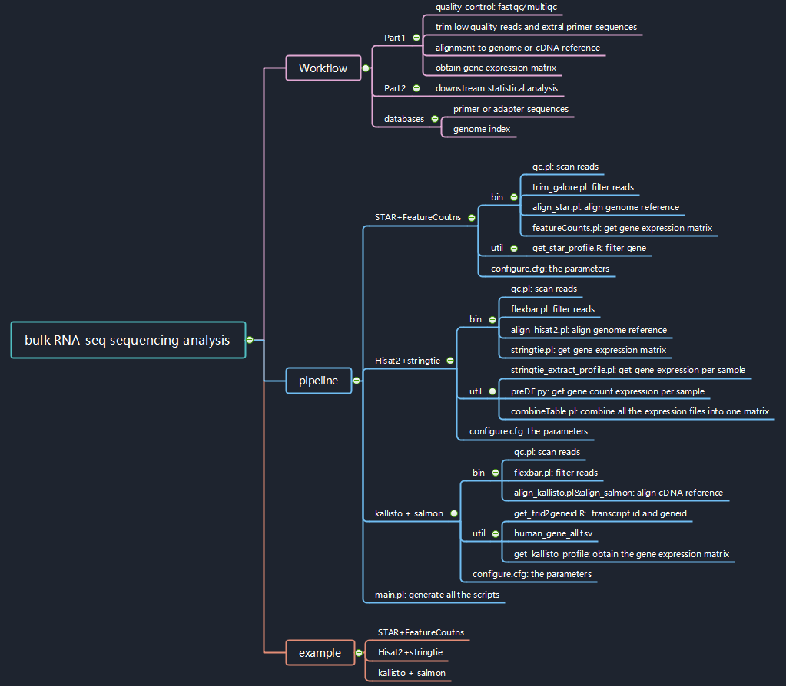

## Bulk RNA Sequencing Analysis Workflow


### Summary of metagenomics workflow




The workflow consists of two parts. ( only for **PE mode** reads)

* the software involved in Part1:

  * fastqc/multiqc
  * trim_galore
  * STAR
  * FeatureCounts
  * flexbar
* hisat2
  * stringtie
  * kallisto
  * salmon
  
  

### How  to run

#### input file

* the fastqpath file 

```bash
find RawData/ -name "*fq.gz" |  sort | perl -e 'print "SampleID\tLaneID\tPath\n"; while(<>){chomp; $fq=(split("\/", $_))[-1]; $sampleid=$fq; $laneid=$fq; $sampleid=~s/\.r[1|2]\.fq.gz//g; $laneid=~s/\.fq.gz//g;print "$sampleid\t$laneid\t$_\n";}' > samples.fqpath.tsv
```

| SampleID | LaneID      | Path                      |
| -------- | ----------- | ------------------------- |
| HBR_Rep1 | HBR_Rep1.r1 | RawData/HBR_Rep1.r1.fq.gz |
| HBR_Rep1 | HBR_Rep1.r2 | RawData/HBR_Rep1.r2.fq.gz |


#### command line 

* STAR_subread

```bash
perl main.pl -f samples.fqpath.tsv -c configure.cfg -p Run.all.sh -t star -o result
```

* hisat2_stringtie

```bash
perl main.pl -f samples.fqpath.tsv -c configure.cfg -p Run.all.sh -t hisat2 -o result
```


* kallisto_salmon

```bash
perl main.pl -f samples.fqpath.tsv -c configure.cfg -p Run.all.sh -t kallisto -o result
```


#### final directory structure

```bash
# tree -L 3 RNA_seq
./RNA_seq
├── README.md
├── bin
│   ├── align_hisat2.pl
│   ├── align_kallisto.pl
│   ├── align_salmon.pl
│   ├── align_star.pl
│   ├── featureCounts.pl
│   ├── flexbar.pl
│   ├── qc.pl
│   ├── stringtie.pl
│   └── trim_galore.pl
├── example
│   ├── 00.STAR_subread
│   │   ├── Run.all.sh
│   │   ├── configure.cfg
│   │   ├── main.pl
│   │   ├── metadata.tsv
│   │   ├── result
│   │   ├── samples.fqpath.tsv
│   │   └── work.sh
│   ├── 01.hisat2_stringtie
│   │   ├── Run.all.sh
│   │   ├── configure.cfg
│   │   ├── main.pl
│   │   ├── metadata.tsv
│   │   ├── result
│   │   ├── samples.fqpath.tsv
│   │   └── work.sh
│   └── 02.kallisto_salmon
│       ├── Run.all.sh
│       ├── configure.cfg
│       ├── get_kallisto_profile.R
│       ├── main.pl
│       ├── metadata.tsv
│       ├── result
│       ├── samples.fqpath.tsv
│       └── work.sh
├── main.pl
├── mindmap_workflow.emmx
├── mindmap_workflow.jpg
├── util
│   ├── combineTable.pl
│   ├── get_kallisto_profile.R
│   ├── get_star_profile.R
│   ├── get_trid2geneid.R
│   ├── human_gene_all.tsv
│   ├── preDE.py
│   ├── stringtie_extract_profile.pl
│   └── temp_human_gene_all.tsv
└── work.sh
```


### Contributors

-   [Hua Zou](https://github.com/zouhua)

