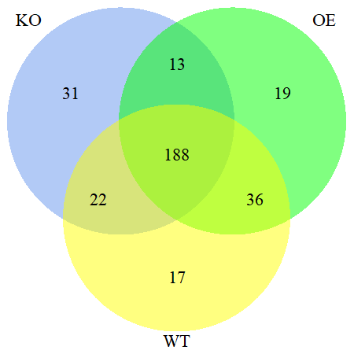

```{r setup, include=FALSE}
knitr::opts_chunk$set(echo = T, warning = F)
library(dplyr)
library(tibble)
library(DT)
library(data.table)
```

### load data 
```{r}
otus <- fread("dataset/otutab.txt") 
phen <- fread("dataset/design.txt")
```

### merge otus and phen into one data.table
```{r}
merge_fun <- function(x, y){
  # filtering OTU by count  
  ratio <- apply(x[, -1], 1, function(x){sum(x > 10)/length(x)})
  otus.temp <- x %>% filter(ratio > 0.4) %>% data.table()
  
  transposedt <- function(dt, varlabel) {
    require(data.table)
    dtrows = names(dt)
    dtcols = as.list(c(dt[, 1]))
    dtt = transpose(dt)
    dtt[, eval(varlabel) := dtrows]
    setnames(dtt, old = names(dtt), new = c(dtcols[[1]], eval(varlabel)))
    dtt = dtt[-1, ]
    setcolorder(dtt, c(eval(varlabel), names(dtt)[1:(ncol(dtt) - 1)]))
    return(dtt)
  }
  otus.t <- transposedt(otus.temp, "SampleID") 
  otus.t2 <- apply(otus.t[, -1], 1, as.numeric) %>% t() %>% data.frame()
  colnames(otus.t2) <- gsub("\r", "", colnames(otus.t)[-1])
  rownames(otus.t2) <- otus.t$SampleID
  res <- inner_join(phen %>% select(c(1, 5:7)), 
            otus.t2 %>% rownames_to_column("SampleID"), by = "SampleID")  
  
  return(res)
}

mdat <- merge_fun(otus, phen)
```

### Specific OTUs in each group

* count more than 20 in each sample

* occurrence ratio more than 40% in each group

* visualized results of the number of specific OTU in each group 

```{r}
specific_otu <- function(x, count, ratio){
  # x <- mdat 
  # count <- 20 
  # ratio <- 0.2
  # count & ratio
  my_ratio <- function(x, n=count, r=ratio){
    return(sum(x > n)/length(x) > r)
  }
  num <- mdat[, -c(1:2, 4)] %>% group_by(genotype) %>% 
    summarise_each(funs(my_ratio)) 
  # otu names 
  lst <- list()
  for (i in 1:nrow(num)){
    lst[[i]] <- colnames(num[i, -1])[which(num[i, -1]==TRUE)] 
  }
  names(lst) <- num$genotype
  
  # count of interset oTU in two groups
  # inner <- c()
  # for(j in 1:(length(lst)-1)){
  #   for(k in j:length(lst)){
  #     if(j != k){
  #       number <- length(intersect(lst[[j]], lst[[k]]))
  #       name <- paste(num$genotype[j], num$genotype[k], sep = "vs")
  #       tmp <- c(name, number)
  #       inner <- rbind(inner, tmp)      
  #     }
  #   }
  # }
  # 
  # # count of each group
  # for(m in 1:length(lst)){
  #   tmp2 <- c(num$genotype[m], length(lst[[m]]))
  #   inner <- rbind(inner, tmp2)
  # }
  # 
  # res <- inner %>% data.frame() %>% 
  #   setNames(c("Group", "Number"))
  # rownames(res) <- NULL
  # return(list(num=res, lst=lst))
  return(lst)
}

inner_otu <- specific_otu(mdat, 20, 0.4)

# visualization
library(VennDiagram)
venn.diagram(x = list(KO = inner_otu$KO, OE = inner_otu$OE, WT = inner_otu$WT),
            filename = "venn.png", 
            height = 450, width = 450, resolution = 300, imagetype = "png", 
            col = "transparent", fill = c("cornflowerblue", "green", 
              "yellow"), alpha = 0.5, cex = 0.45, 
          cat.cex = 0.45)
```



### rarefraction

* alpha rarefraction from Usearch. 
PS: please browse the details in this [website](https://blog.csdn.net/woodcorpse/article/details/79070184) 
```{r}
rare <- fread("dataset/alpha/alpha_rare.txt")
phen <- fread("dataset/design.txt")
```
```{r}
library(ggplot2)
dat.rare <- rare %>% tidyr::gather("SampleID", "value", -richness)
rare.phen <- inner_join(phen %>% select(SampleID, genotype), 
                        dat.rare, by = "SampleID") %>% 
  mutate(richness=factor(richness, levels = c(1:100)),
         genotype=factor(genotype))

ggplot(rare.phen, aes(x=richness, y=value, group=SampleID, color=genotype)) + 
  geom_line()+
  xlab("Rarefraction Percentage")+
  ylab("Richness (Observed OTUs)")+
  scale_x_discrete(breaks = c(1:10)*10, labels = c(1:10)*10)+
  theme_classic()
```

