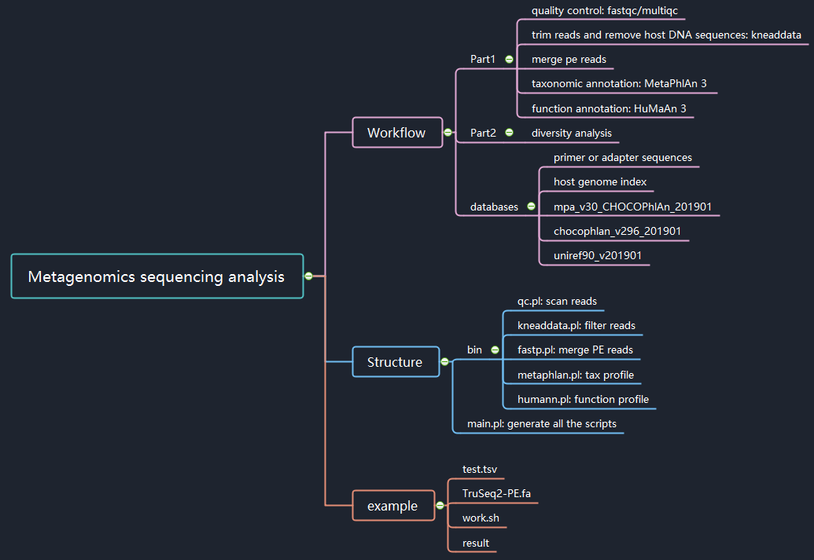

## Metagenomics Sequencing Analysis Workflow


### Summary of metagenomics workflow




The workflow consists of two parts. 

* the software involved in Part1:

  * fastqc/multiqc
  * kneaddata
  * fastp 
  * MetaPhlAn version 3
  * HumaAn version 3

  

### How  to run

#### input file

the fastqpath file

```bash
find /RawData/ -name "*fq.gz" |  sort | perl -e 'print "SampleID\tLaneID\tPath\n"; while(<>){chomp; $fq=(split("\/", $_))[-1]; $sampleid=$fq; $laneid=$fq; $sampleid=~s/\_R[1|2]\.fq.gz//g; $laneid=~s/\.fq.gz//g;print "$sampleid\t$laneid\t$_\n";}' > samples.fqpath.tsv
```


| SampleID | LaneID | Path                 |
| -------- | ------ | -------------------- |
| ND2      | ND2_R1 | RawData/ND2_R1.fq.gz |
| ND2      | ND2_R2 | RawData/ND2_R2.fq.gz |

#### command line 

```bash
perl main.pl -f test.tsv -a TruSeq2-PE.fa -o Run.all.sh
```


#### final directory structure

```bash
# tree -L 3 metagenomics
metagenomics
├── README.md
├── bin
│   ├── convert2matrix.pl
│   ├── humann.pl
│   ├── kneaddata.pl
│   ├── merge.pl
│   ├── metaphlan.pl
│   └── qc.pl
├── example
│   ├── Run.all.sh
│   ├── TruSeq2-PE.fa
│   ├── result
│   │   ├── 00.quality
│   │   ├── 01.kneaddata
│   │   ├── 02.merge
│   │   ├── 03.humann
│   │   ├── 04.metaphlan
│   │   ├── 05.profile
│   │   ├── Run.s1.qc.sh
│   │   ├── Run.s2.kneaddata.sh
│   │   ├── Run.s3.merge.sh
│   │   ├── Run.s4.humann.sh
│   │   ├── Run.s5.metaphlan.sh
│   │   ├── Run.s6.profile.sh
│   │   └── script
│   ├── test.tsv
│   └── work.sh
├── main.pl
├── mindmap_workflow.emmx
├── mindmap_workflow.jpg
└── util
    ├── calculate_unifrac.R
    └── mpa_v30_CHOCOPhlAn_201901_species_tree.nwk

11 directories, 22 files
```


### Contributors

-   [Hua Zou](https://github.com/zouhua)

